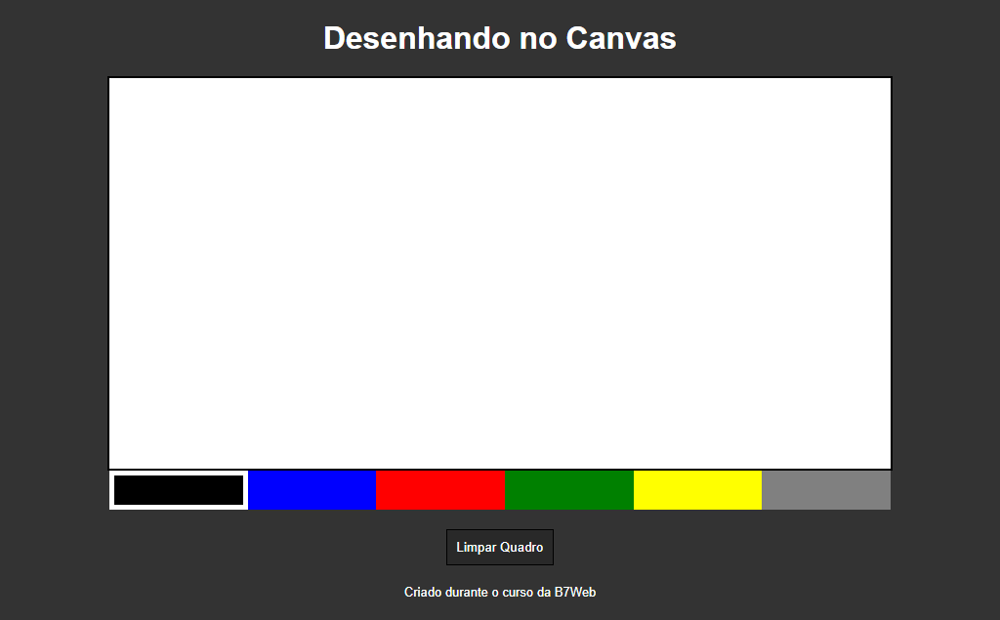

# Desenhando

> Projeto Desenhando

Esse é o projeto Desenhando criado durante o curso de JavaScript da B7Web.

[Clique para acessar](https://guimiiller.github.io/desenhando/)

## 🚀 Tecnologias

- HTML
- CSS
- JavaScript
- Git e Github

## 💻 O que aprendi

- Aprendi a usar o canvas e manipular ele com JavaScript
- Aprendi a usar os eventos de mouse 

## 📨 Contato

- guilhermemillerblack@gmail.com